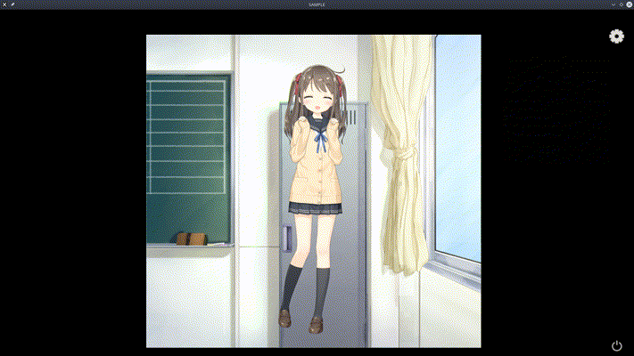

# Live2D-Linux-Native-Sample




Live2D Sample Linux Native with OpenGL 

From official repo https://github.com/Live2D/CubismNativeSamples


## Environment

| OS                | Ubuntu 18.04 / 64 bit |
| ----------------- | --------------------- |
| **Packages**      | **Version**           |
| CMake             | 3.16                  |
| Cubism SDK Native | 2.1 (Beta)            |
| GLEW              | 2.1.0                 |
| GLFW              | 3.3                   |

#### * Warning *

Normally, Ubuntu 18.04 's `CMake` does not meet the requirement,    
You need to uninstall and install `Version 3.16` .


## Setup, and Run

```bash
# download and setup all libraries (Will not install to system)
./setupSDK
# Run the example
./launch
```


## Know More

Desktop Widget with Electron 
https://github.com/zenghongtu/PPet @ [zenghongtu](https://github.com/zenghongtu)
