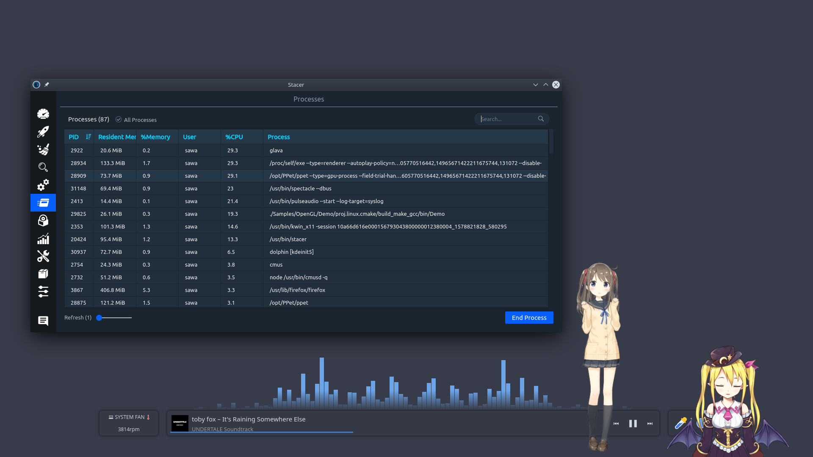

# Live2D-Linux-Native-Sample


Live2D Sample Linux Native with OpenGL 

From official repo https://github.com/Live2D/CubismNativeSamples


## Environment

| OS                | Ubuntu 18.04 / 64 bit |
| ----------------- | --------------------- |
| **Packages**      | **Version**           |
| CMake             | 3.16                  |
| Cubism SDK Native | 2.1 (Beta)            |
| GLEW              | 2.1.0                 |
| GLFW              | 3.3                   |

#### * Warning *

Normally, Ubuntu 18.04 's `CMake` does not meet the requirement,    
You need to uninstall and install `Version 3.16` .


## Performance



| Programs                           | CPU (i7-8565U 4c-8t)* | RAM          |
| ---------------------------------- | --------------------- | ------------ |
| Glava                              | 29.3%                 | 20.6 MiB     |
| **Live 2D Native cubism 3 OpenGL** | **19.3%**             | **26.1 MiB** |
| Electron Live2D cubism 2           | 29.1%                 | 73.7 MiB     |

\*The CPU usage is the sum of the usage of each cores.   

Electron Live2D cubism 2 program here use [PPet](https://github.com/zenghongtu/PPet) as example.  
Electron version require V8 runtime, web-sevber for backend API.   
Since these two are different models/ codebase, they cannot be compared directly, so just for reference.   


## Setup, and Run

```bash
# download and setup all libraries (Will not install to system)
# compile the code after finished setup
./setupSDK

# Run the example
./launch

# Compile the code (For develop)
./build
```


## Know More...

Cubism 2 Desktop Widget with Electron - PPet   
https://github.com/zenghongtu/PPet @ [zenghongtu](https://github.com/zenghongtu)
